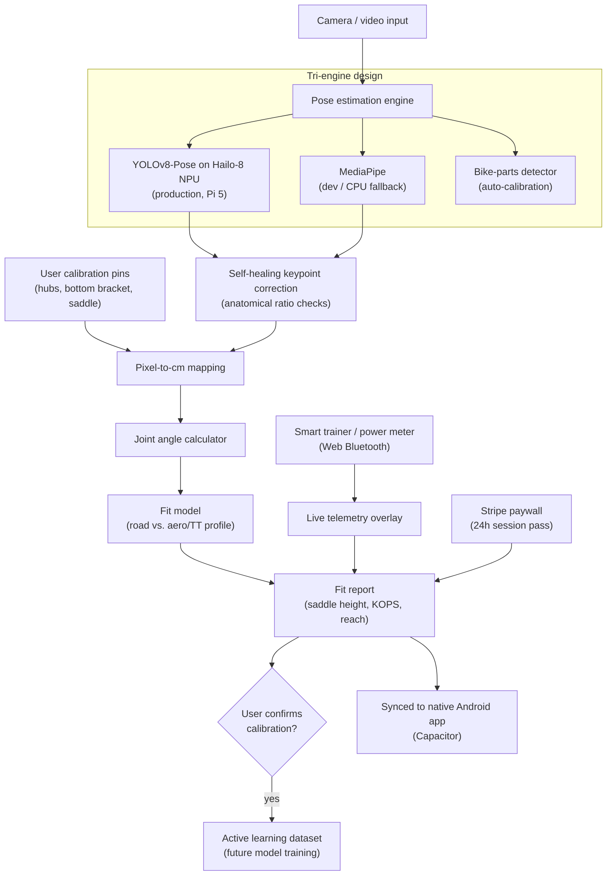
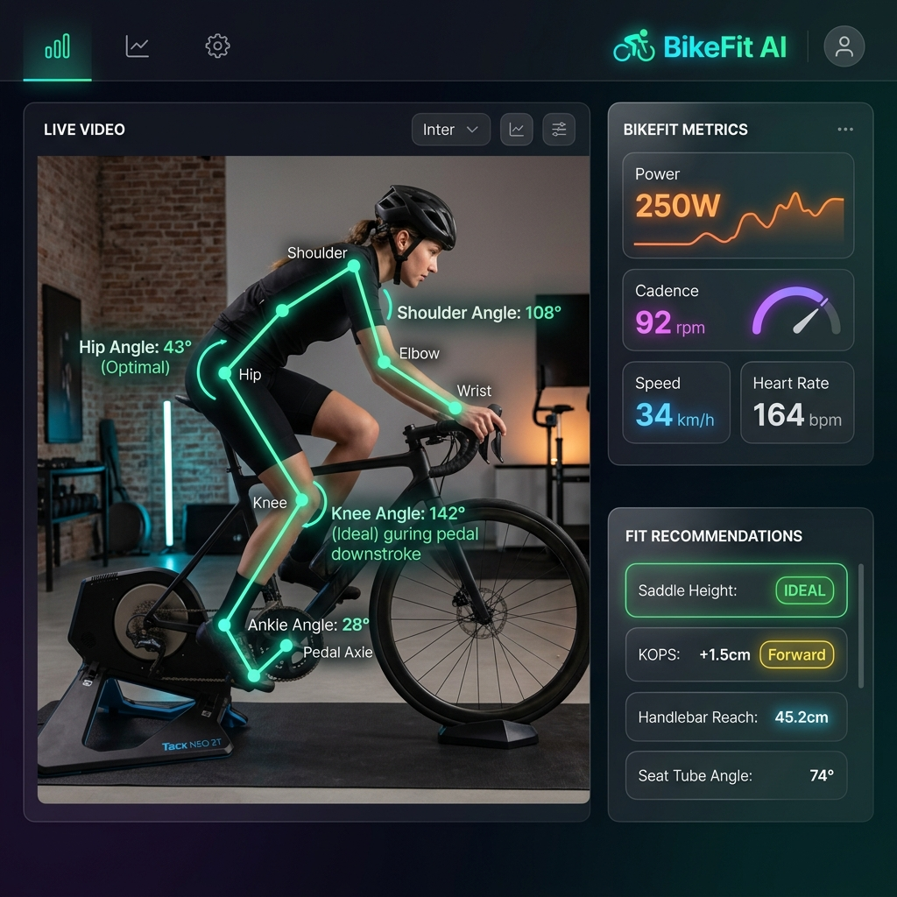
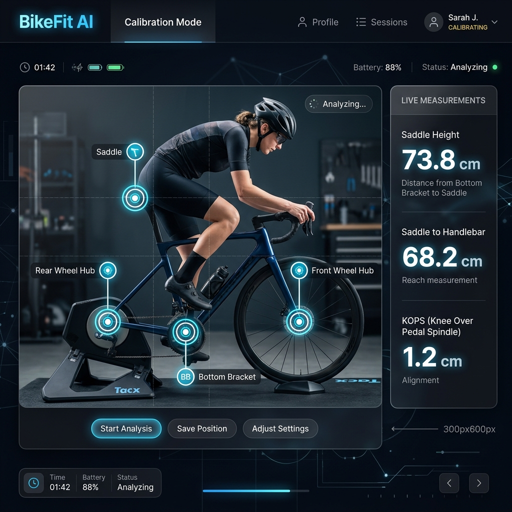

# BikeFit AI

> Computer-vision cycling position analysis — points a camera at a rider on a trainer, tracks their joints in real time, and turns that into physical, centimeter-accurate bike fit recommendations.

**Live product:** [bike.coachonurai.com](https://bike.coachonurai.com) · [Google Play](https://play.google.com/store/apps/details?id=com.trihonor.bikefitai)

**This is a documentation-only repository.** BikeFit AI is closed-source, production software with real users on web and Android, built and run by me end-to-end. The source isn't published here because it's a commercial product. This repo is an architecture write-up for recruiters and other engineers — no source code, credentials, or user data is included.

---

## The problem

A proper bike fit — saddle height, knee-over-pedal-spindle, reach — normally means booking a fitter, a static camera, and a couple of hours. Most riders never do it, ride slightly wrong for years, and either lose power or get hurt. The information needed to fix that (where your joints actually are relative to the bike, in real physical units) is entirely computable from a side-on video — the hard part is making that computation accurate, real-time, and cheap enough to run on a $70 board instead of a fitting studio's PC.

## What it does

- **Tracks the rider's joints in real time** from ordinary camera input — shoulder, elbow, hip, knee, ankle — as they pedal.
- **Converts pixels to physical centimeters.** The rider pins the front hub, rear hub, bottom bracket, and saddle once; combined with the bike's known wheelbase, that anchors the whole video in real-world units, so saddle height and knee-over-pedal-spindle come out in centimeters, not arbitrary pixel ratios.
- **Corrects its own mistakes.** When the bike's frame occludes a joint and the pose model's guess is anatomically impossible (e.g. a shin/thigh ratio that doesn't exist), the system detects that and corrects the keypoint instead of propagating a bad reading into the fit recommendation.
- **Understands two riding styles.** Ideal joint angles differ for a traditional road position versus an aero triathlon/TT position — recommendations are computed against the profile that's actually relevant.
- **Overlays real sensor data.** Connects directly to smart trainers and power meters over Bluetooth and lays live watts/cadence/speed on top of the biomechanical read-out.
- **Gets smarter from real usage.** When a user confirms or corrects a calibration point, that frame is captured and stored as labeled training data — production usage doubles as a data collection pipeline for improving the underlying model.

## Architecture



## Engineering decisions worth calling out

**Edge inference, not cloud inference.** Production pose estimation runs on a Raspberry Pi 5 with a Hailo-8 NPU, not a cloud GPU. A cycling fit session is real-time and camera-heavy — streaming raw video to a cloud model for every frame would add latency and cost that a dedicated on-device accelerator avoids entirely.

**Three engines, not one.** Development uses CPU-only MediaPipe for fast iteration without needing the actual NPU hardware; production uses the heavier, more accurate YOLOv8-Pose model that only makes sense on the Hailo accelerator. Keeping these separate meant the dev loop never got blocked on production hardware.

**Don't trust a keypoint just because the model returned one.** Bicycle geometry regularly occludes a knee or ankle from a side-on camera. Rather than accept whatever the pose model guesses, the system checks the result against known anatomical proportions (e.g. shin-to-thigh ratio) and corrects it when the guess is physically impossible — a cheap check that meaningfully improves fit accuracy in the exact frames that matter most.

**Calibration via known reference geometry, not depth sensors.** Turning pixels into centimeters without a depth camera means anchoring the scene to something with a known real-world size. Using the bike's own wheelbase plus four pinned reference points solves that with a regular 2D camera, keeping hardware requirements down to "a phone or webcam."

**Production usage feeds the model.** Every user-confirmed calibration is captured as labeled data in a standard YOLO dataset format — the active learning loop is built into the product surface itself rather than being a separate offline data collection effort.

**One web core, synced to native.** The web app is the single source of truth; a build pipeline syncs it into a Capacitor-wrapped native Android shell, so there's one frontend codebase to maintain instead of two diverging ones.

## Sample fit report (illustrative)

```
Rider profile: Road

Saddle Height     : 73.8 cm     → IDEAL
KOPS              : +1.2 cm     → Forward of spindle, within tolerance
Handlebar Reach   : 68.2 cm
Knee Angle        : 142°        → Ideal at pedal downstroke
Hip Angle         : 43°         → Optimal

Live telemetry: 250W · 92rpm · 34km/h · HR 164bpm
```

## Screenshots

<p>
  
  
</p>

## Stack

**Vision:** YOLOv8-Pose (Ultralytics), MediaPipe, OpenCV
**ML:** scikit-learn (ideal-angle prediction model)
**Backend:** FastAPI (Python), SQLite
**Hardware:** Raspberry Pi 5 + Hailo-8 NPU (26 TOPS)
**Connectivity:** Web Bluetooth API (smart trainers, power meters)
**Payments:** Stripe (session-based paywall)
**Mobile:** Capacitor (native Android wrapper), published on Google Play
**i18n:** 10 languages

## What this repo is (and isn't)

- **Is:** an architecture write-up and case study, meant to show how the system is designed and why.
- **Isn't:** the source code or an install guide. BikeFit AI is closed, proprietary software — see the live product at [bike.coachonurai.com](https://bike.coachonurai.com).

If you're an engineer or a hiring team and want to talk through any of the design decisions above in more depth, feel free to reach out via my GitHub profile.
